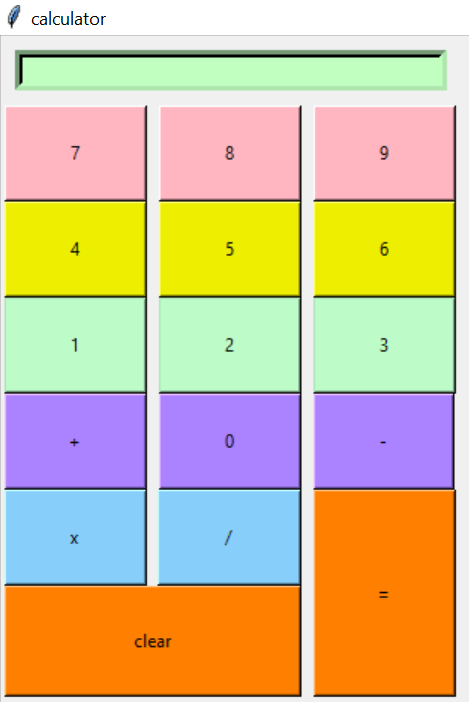

# Simple-Calculator-with-Tkinter
This Python script creates a simple calculator using the Tkinter library. The calculator provides basic arithmetic operations such as addition, subtraction, multiplication, and division.

The graphical user interface (GUI) includes an Entry widget for displaying input and results. Users can input numbers and perform operations by clicking on buttons. The script defines functions for handling button clicks, performing calculations, and clearing the display.

The calculator layout is organized using grid layout management, with buttons arranged in rows and columns for a user-friendly interface. Each button is associated with a command function that executes specific operations when clicked.

Overall, this script provides a straightforward implementation of a calculator application using Tkinter in Python. Users can perform arithmetic calculations conveniently within the GUI environment.

